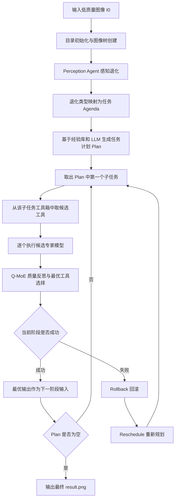
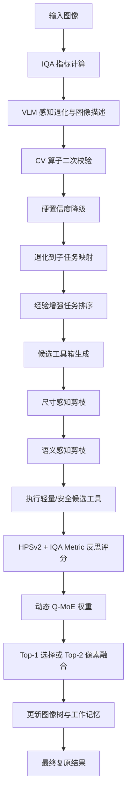

# 毕业设计系统算法说明文档：基于任务感知与策略选择的图像复原智能体

生成日期：2026-05-08  
系统名称：基于任务感知与策略选择的图像复原智能体  
核心算法基础：4KAgent: Agentic Any Image to 4K Super-Resolution  
算法实现目录：`4KAgent/`  
前后端系统目录：`image-restoration-agent/`

## 1. 文档定位

本文档面向毕业设计论文与系统答辩，重点说明图像复原智能体算法的整体思路、原生 4KAgent 的处理流程、本毕业设计在原流程上的创新改进，以及这些改进分别插入到算法链路的哪个阶段。

与 `image-restoration-agent/TECHNICAL_DOCUMENTATION.md` 不同，本文不重点描述 Web 前后端工程接口，而是重点描述底层图像复原算法逻辑，包括：

1. 图像复原任务如何从输入图像转化为任务序列。
2. 原生 4KAgent 如何完成感知、计划、执行、反思、回滚。
3. 本系统如何针对 VLM 感知幻觉、重度模型算力冗余、显存溢出、生成式伪影等问题进行改进。
4. 原始流程和创新流程的具体差异。
5. 每个创新点对应的算法公式、伪代码、源码插入位置与算法作用。

## 2. 系统算法总览

本毕业设计系统可以抽象为一个“感知-决策-执行-反馈”的图像复原智能体。

给定一张低质量输入图像 $I_0$，系统并不直接调用单个固定复原网络，而是先分析图像存在的退化类型，再将复原任务拆分为若干子任务，随后为每个子任务选择候选工具集合，执行多个专家模型，最后根据质量评价机制选择当前阶段的最佳结果，并将其作为下一阶段输入。

整体目标可表示为：

$$
I^\* = \mathcal{A}(I_0; P, T, S, R)
$$

其中：

| 符号 | 含义 |
| --- | --- |
| $I_0$ | 输入低质量图像 |
| $I^\*$ | 最终复原图像 |
| $\mathcal{A}$ | 图像复原智能体算法 |
| $P$ | 感知模块，负责识别图像退化和内容描述 |
| $T$ | 任务计划模块，负责生成复原子任务序列 |
| $S$ | 工具选择模块，负责为每个子任务筛选候选专家 |
| $R$ | 反思评价模块，负责在多个工具输出中选择最优结果 |

系统的核心不是单一神经网络，而是一个可调度的多专家复原框架。它将图像复原问题从传统的“端到端单模型推理”转化为“任务感知、策略选择、多专家执行、质量反馈”的智能体决策问题。

## 3. 原生 4KAgent 的基础思想

### 3.1 原生 4KAgent 解决的问题

传统图像复原方法通常针对单一退化训练专门模型，例如：

| 退化类型 | 常见任务 |
| --- | --- |
| 低分辨率 | 超分辨率 |
| 噪声 | 去噪 |
| 运动模糊 | 运动去模糊 |
| 离焦模糊 | 离焦去模糊 |
| 雾霾 | 去雾 |
| 雨线 | 去雨 |
| 暗光 | 亮度增强 |
| JPEG 压缩伪影 | JPEG artifact removal |

但是，真实图像往往同时存在多种退化。例如一张老照片可能同时有低分辨率、噪声、模糊、划痕、人脸退化和压缩伪影。单一模型通常难以覆盖全部场景。

原生 4KAgent 的思想是：

1. 将输入图像视为一个未知退化组合样本。
2. 使用视觉语言模型或质量评价模型识别退化。
3. 将退化映射为复原子任务。
4. 使用语言模型和经验库决定任务顺序。
5. 对每个任务调用多个候选专家模型。
6. 通过质量评价选择当前阶段最佳结果。
7. 如果阶段结果不理想，则回滚并重新规划。

### 3.2 原生 4KAgent 的主流程

原生流程可以描述为：



在源码中，主流程由 `pipeline/the4kagent_pipeline.py` 中的 `The4KAgent.run()` 控制。

核心函数调用关系：

```text
The4KAgent.run()
├── propose()
│   ├── evaluate_degradation()
│   ├── extract_agenda()
│   └── schedule()
├── execute_subtask()
│   ├── _prepare_for_subtask()
│   ├── tool_selection()
│   ├── Tool.__call__()
│   ├── evaluate_tool_result_onetime()
│   └── _record_tool_res()
├── roll_back()
├── reschedule()
└── _record_res()
```

## 4. 本系统总体创新思路

原生 4KAgent 已经具备较完整的智能体复原框架，但在毕业设计应用场景中仍存在三个突出问题：

1. 感知不稳定  
   多模态大模型可能将正常纹理误判为模糊、噪声或暗光，导致错误任务被加入计划。

2. 工具选择冗余  
   原始工具箱中同时包含轻量模型和重度生成式模型。对大图或轻度退化图像盲目调用重模型，容易造成显存溢出和推理延迟过高。

3. 反思选择过于“赢者通吃”  
   原始 Q-MoE 通常选出一个得分最高的工具输出作为下一阶段输入。若 Top-1 生成式模型局部出现幻觉伪影，系统缺乏像素级兜底机制。

围绕上述问题，本系统在原生流程的三个阶段加入改进：

| 阶段 | 原生流程 | 创新流程 |
| --- | --- | --- |
| 感知阶段 | VLM 直接输出退化类型或严重程度 | VLM + 传统 CV 算子双重校验，拦截模糊/暗光误判 |
| 决策/执行前阶段 | 按 profile 和子任务选择候选工具 | 引入物理尺寸和语义先验的强剪枝路由 |
| 反馈阶段 | 静态 HPSv2 + Metric 评分，Top-1 选择 | 退化感知动态 Q-MoE 权重，并设计 Top-2 置信度融合 |

总的创新流程如下：



## 5. 算法数据结构

### 5.1 退化类型与子任务映射

在 `The4KAgent._set_constants()` 中，系统维护退化类型到子任务的映射：

| 退化类型 Degradation | 子任务 Subtask |
| --- | --- |
| `low resolution` | `super-resolution` |
| `low resolution_2x` | `super-resolution_2x` |
| `noise` | `denoising` |
| `motion blur` | `motion deblurring` |
| `defocus blur` | `defocus deblurring` |
| `haze` | `dehazing` |
| `rain` | `deraining` |
| `dark` | `brightening` |
| `jpeg compression artifact` | `jpeg compression artifact removal` |
| `low quality face` | `face restoration` |
| `old photo` | `old_photo_restoration` |

该映射是整个算法从“感知结果”转向“可执行复原任务”的桥梁。

### 5.2 工作记忆 work_mem

4KAgent 在运行过程中维护一个工作记忆 `work_mem`，用于记录计划、执行路径、工具调用次数和动态图像树。

抽象结构如下：

```json
{
  "plan": {
    "initial": [],
    "adjusted": []
  },
  "execution_path": {
    "subtasks": [],
    "tools": []
  },
  "n_invocations": 0,
  "tree": {
    "img_path": "img_tree/0-img/input.png",
    "best_descendant": null,
    "children": {}
  }
}
```

其中：

| 字段 | 含义 |
| --- | --- |
| `plan.initial` | 初始任务计划 |
| `plan.adjusted` | 回滚后重新规划的记录 |
| `execution_path.subtasks` | 最终结果经历的子任务序列 |
| `execution_path.tools` | 最终结果经历的工具序列 |
| `n_invocations` | 专家工具调用总次数 |
| `tree` | 图像状态树，记录每次子任务和每个工具输出 |

### 5.3 图像树 ImgTree

4KAgent 并不是只保留最终图像，而是将每一步工具输出都组织为图像树：

```text
img_tree/
├── 0-img/
│   └── input.png
├── subtask-super-resolution/
│   ├── tool-hat_gan/
│   │   └── 0-img/output.png
│   └── tool-swinir_gan/
│       └── 0-img/output.png
└── subtask-denoising/
    ├── tool-swinir_15/
    │   └── 0-img/output.png
    └── tool-nafnet/
        └── 0-img/output.png
```

图像树的作用：

1. 记录每个候选工具的输出。
2. 支持回滚到父节点。
3. 支持生成 `summary.json` 和 `img_tree.html`。
4. 支持根据最终图像路径反推执行链路。

## 6. 原生流程一：感知阶段

### 6.1 原生感知方式

原生 4KAgent 支持多种感知方式：

| 感知方式 | 说明 |
| --- | --- |
| `gpt4v` | 使用 GPT-4V 类视觉语言模型判断退化严重程度 |
| `depictqa` | 使用 DepictQA 进行图像质量/退化评估 |
| `vlmagent` | 使用本地 VLM agent 结合 IQA 指标输出退化 |
| `llama_vision` | 使用 Llama Vision Agent 进行感知和计划 |

在 profile 中通过：

```yaml
PerceptionAgent: gpt4v
```

指定当前感知模型。

### 6.2 原生 GPT-4V 感知输出

原生 GPT-4V 感知任务要求模型对七类退化输出严重程度：

```text
noise
motion blur
defocus blur
haze
rain
dark
jpeg compression artifact
```

每类退化严重程度取值：

```text
very low
low
medium
high
very high
```

原始输出格式近似为：

```json
[
  {
    "degradation": "noise",
    "thought": "The image does not appear to be noisy.",
    "severity": "low"
  },
  {
    "degradation": "motion blur",
    "thought": "The image is blurry in the vertical direction.",
    "severity": "high"
  }
]
```

### 6.3 原生退化到任务的转换

在 `extract_agenda()` 中，原生逻辑为：

1. 遍历 VLM 输出的退化严重程度。
2. 如果某类退化严重程度大于等于 `medium`，则加入任务列表。
3. 根据图像尺寸判断是否需要超分任务。
4. 随机打乱初始 agenda，后续交给 schedule 重新排序。

严重程度阈值：

```python
if self.levels.index(severity) >= 2:
    agenda.append(self.degra_subtask_dict[degradation])
```

其中 `self.levels` 为：

```python
["very low", "low", "medium", "high", "very high"]
```

因此，`medium`、`high`、`very high` 会触发复原子任务。

### 6.4 原生感知阶段的问题

原生 VLM 感知存在以下问题：

1. 对纹理敏感  
   草地、毛发、织物、建筑纹理等高频内容可能被误判为噪声或模糊。

2. 对曝光判断不稳定  
   对局部阴影或暗背景图片可能误判为整体暗光。

3. 没有二次校验  
   一旦 VLM 输出 `medium` 及以上严重程度，下游就会直接安排复原任务。

4. 错误感知会造成破坏性修复  
   如果清晰图被误判为模糊，去模糊模型可能破坏原始纹理；如果正常图被误判为暗光，亮度增强可能导致过曝。

## 7. 创新流程一：基于传统 CV 算子的双重混合感知校验

### 7.1 创新动机

视觉语言模型擅长语义理解，但对某些底层图像退化的判断不一定稳定。传统 CV 算子虽然表达能力有限，但在某些物理属性判断上具有确定性和低成本优势。

因此，本系统不是完全相信 VLM，而是在 VLM 给出风险判断后，引入传统 CV 指标进行二次校验。

该创新插入位置：

```text
原生流程：VLM 输出退化严重程度 -> extract_agenda
创新流程：VLM 输出退化严重程度 -> CV 算子复核 -> 严重程度降级 -> extract_agenda
```

源码位置：

```text
4KAgent/pipeline/the4kagent_pipeline.py
└── evaluate_degradation_by_gpt4v()
```

### 7.2 防模糊误判：拉普拉斯方差校验

模糊图像通常边缘高频信息较少，拉普拉斯二阶导数响应较弱；清晰图像边缘和纹理丰富，拉普拉斯方差较大。

对灰度图 $I_{gray}$ 计算：

$$
V_{lap} = Var(\Delta I_{gray})
$$

其中：

| 符号 | 含义 |
| --- | --- |
| $I_{gray}$ | 输入图像灰度图 |
| $\Delta$ | Laplacian 二阶微分算子 |
| $V_{lap}$ | 拉普拉斯响应方差 |

触发条件：

```text
VLM 判断 defocus blur 或 motion blur 的严重程度 >= medium
```

校验规则：

$$
V_{lap} > 300.0 \Rightarrow \text{图像边缘足够锐利，推翻模糊诊断}
$$

处理动作：

```text
defocus blur severity = very low
motion blur severity = very low
```

### 7.3 防暗光误判：灰度均值校验

对灰度图计算平均亮度：

$$
\mu = \frac{1}{H \times W}\sum_{i=1}^{H}\sum_{j=1}^{W} I_{gray}(i,j)
$$

触发条件：

```text
VLM 判断 dark 的严重程度 >= medium
```

校验规则：

$$
\mu > 80.0 \Rightarrow \text{全局曝光并不暗，推翻暗光诊断}
$$

处理动作：

```text
dark severity = very low
```

### 7.4 硬置信度降级策略

本系统没有直接删除退化项，而是将误判退化的严重程度改为 `very low`。

这样设计的原因：

1. 保持 VLM 原始输出的数据结构。
2. 避免下游字典映射和格式检查失败。
3. 让 `extract_agenda()` 自然过滤掉低严重程度退化。
4. 不破坏原生 4KAgent 的接口形式。

原始方式：

```text
VLM 输出 medium blur -> 加入 motion deblurring / defocus deblurring
```

创新方式：

```text
VLM 输出 medium blur
-> Laplacian 方差复核
-> 如果图像清晰，则 severity = very low
-> extract_agenda 不加入去模糊任务
```

### 7.5 伪代码

```text
Algorithm 1: Hybrid Perception Verification

Input:
  I: input image
  E: VLM evaluation list [(degradation, severity)]

Output:
  E': calibrated evaluation list

1. Convert I to grayscale image G
2. Convert E to dictionary D
3. severe_levels = {medium, high, very high}

4. if D[defocus blur] in severe_levels or D[motion blur] in severe_levels:
5.     lap_var = Variance(Laplacian(G))
6.     if lap_var > 300:
7.         D[defocus blur] = very low
8.         D[motion blur] = very low

9. if D[dark] in severe_levels:
10.    mean_brightness = Mean(G)
11.    if mean_brightness > 80:
12.        D[dark] = very low

13. return D converted back to list
```

### 7.6 与原生流程的差异

| 对比项 | 原生 4KAgent | 本系统创新流程 |
| --- | --- | --- |
| 感知依据 | VLM 直接判断 | VLM 判断 + CV 指标复核 |
| 模糊判断 | 依赖语言模型视觉判断 | 增加拉普拉斯方差物理校验 |
| 暗光判断 | 依赖语言模型视觉判断 | 增加灰度均值校验 |
| 错误处理 | 误判直接进入任务计划 | 误判严重程度降级为 `very low` |
| 下游兼容 | 原生结构 | 完全保持原生结构 |
| 收益 | 能识别复杂语义 | 减少 VLM 幻觉导致的错误修复 |

### 7.7 算法落点

该创新位于感知阶段末端、任务抽取阶段之前。可在 `evaluate_degradation_by_gpt4v()` 中看到：

```text
【新增创新点 5：基于传统 CV 算子的双重混合感知校验】
```

其算法作用是对 VLM 输出的退化严重程度进行二次校准，避免被误判的模糊或暗光退化进入后续 `extract_agenda()`。

## 8. 原生流程二：任务计划与排序

### 8.1 Agenda 生成

感知阶段输出退化类型后，系统会生成待执行任务列表 `agenda`。

示例：

```text
输入图像退化：
noise = high
jpeg compression artifact = medium
low resolution = true

agenda:
["denoising", "jpeg compression artifact removal", "super-resolution"]
```

### 8.2 4K 目标倍率计算

系统通过 `get_target_factor()` 判断是否需要超分，以及需要几倍超分。

当 `Upscale4K = true` 时，算法希望图像最大边接近或达到 4K 尺寸：

```text
如果 max_side >= 4000，则不超分
否则从 {2, 4, 8, 16} 中选择最小的 factor，使 max_side * factor >= 4000
```

公式化表示：

$$
s^\* = \min \{s \mid s \in \{2,4,8,16\},\; max(H,W) \times s \ge 4000 \}
$$

如果 `Upscale4K = false`，则使用传统逻辑：

1. 如果图像最大边小于 `require_sr_size`，使用 `ScaleFactor` 或默认 4 倍。
2. 否则不执行超分。

### 8.3 Schedule 任务排序

原生 4KAgent 不是固定按某种硬编码顺序执行任务，而是使用 LLM 和经验库进行排序。

经验库文件：

```text
4KAgent/memory/schedule_experience.json
```

经验库记录了多种退化组合下不同执行顺序的失败率。例如：

| 退化组合 | 更优顺序 |
| --- | --- |
| dark + noise | 先去噪，再亮度增强 |
| defocus blur + haze | 先离焦去模糊，再去雾 |
| motion blur + low resolution | 先运动去模糊，再超分 |
| rain + low resolution | 先去雨，再超分 |
| jpeg artifact + defocus blur | 先 JPEG 伪影去除，再离焦去模糊 |

原生排序可抽象为：

$$
Plan = LLM(Agenda, Degradations, Experience)
$$

### 8.4 原生计划阶段的问题

原生任务计划关注“任务顺序”，但对“具体候选工具是否适合当前图像”判断不足。

例如：

1. 对 1080P 或更大图像仍可能把 DiffBIR、OSEDiff、DiffPlugin、MAXIM、Restormer 等重模型放入候选池。
2. 对 JPEG 伪影去除、轻度去噪、亮度增强等轻量任务，仍可能调用生成式模型。
3. 候选工具过多导致推理时间和显存风险大幅上升。

因此，本系统将创新点放在“任务计划之后、工具执行之前”的候选工具路由阶段。

## 9. 创新流程二：基于物理尺寸与语义先验的强剪枝路由

### 9.1 创新动机

在图像复原任务中，并不是所有专家模型都适合所有输入。

重度生成式模型通常具有如下特点：

1. 模型体积大。
2. 显存占用高。
3. 推理时间长。
4. 对大分辨率图像容易 OOM。
5. 可能产生结构性幻觉和纹理伪影。

对于大图或轻度退化任务，更合理的策略是优先使用轻量、稳定、确定性更强的复原模型。

### 9.2 原生工具选择流程

原生 `tool_selection()` 主要考虑：

1. 当前 profile 是否是 Baseline。
2. 超分任务是 Fidelity 偏好还是 Perception 偏好。
3. Fast profile 下的大图超分是否过滤 `diffbir`。

可以概括为：

```text
profile -> subtask toolbox -> preference filter -> execute candidates
```

### 9.3 创新工具选择流程

本系统在 `tool_selection()` 中加入两类强约束：

1. 物理尺寸约束：根据图像长边判断是否容易 OOM。
2. 语义任务约束：根据当前子任务判断是否需要重度生成式模型。

创新流程：

```text
profile -> subtask toolbox -> preference filter
-> physical-size routing
-> semantic-task routing
-> heavy model pruning
-> execute safe candidates
```

源码位置：

```text
4KAgent/pipeline/the4kagent_pipeline.py
└── tool_selection()
```

### 9.4 重度模型黑名单

当前代码定义的重度模型黑名单：

```python
heavy_models = [
    "diffbir",
    "osediff",
    "diffplugin",
    "maxim",
    "restormer",
    "xrestormer"
]
```

这些模型被列入黑名单的原因：

| 模型 | 风险 |
| --- | --- |
| DiffBIR | 扩散先验模型，显存和时间成本高 |
| OSEDiff | 生成式超分模型，对大图开销高 |
| DiffPlugin | Stable Diffusion 插件式修复，生成式风险较高 |
| MAXIM | 多任务大模型，在部分任务下开销大 |
| Restormer | Transformer 结构，高分辨率输入开销大 |
| X-Restormer | 多任务 Transformer，显存敏感 |

### 9.5 物理尺寸约束：尺寸感知防 OOM

读取当前阶段输入图像尺寸：

```python
cur_img = cv2.imread(self.cur_node["img_path"])
img_shape = cur_img.shape[:2]
max_side = max(img_shape)
```

当：

$$
max\_side \ge 1024
$$

系统认为当前图像已经进入较高显存风险区间，触发尺寸感知路由：

```text
allow_heavy_model = False
```

随后剔除重度模型：

```python
updated_toolbox = [
    tool for tool in updated_toolbox
    if tool.tool_name.lower() not in heavy_models
]
```

### 9.6 语义任务约束：退化感知防算力浪费

对于以下轻量任务：

```text
jpeg compression artifact removal
denoising
brightening
```

系统认为无需调用生成式大模型：

```text
allow_heavy_model = False
```

原因：

1. JPEG 去伪影通常需要局部块效应修复，不需要全局生成。
2. 去噪任务更关注保真度，生成式模型可能产生不真实纹理。
3. 亮度增强可以由 CLAHE、Gamma、Constant Shift 等轻量方法解决。

### 9.7 伪代码

```text
Algorithm 2: Constraint-aware Tool Routing

Input:
  subtask: current restoration subtask
  toolbox: original candidate tools
  I: current image

Output:
  toolbox': pruned candidate tools

1. max_side = max(height(I), width(I))
2. toolbox' = profile_filter(toolbox)
3. allow_heavy_model = True

4. if max_side >= 1024:
5.     allow_heavy_model = False
6.     log("physical-size routing triggered")

7. if subtask in {jpeg artifact removal, denoising, brightening}:
8.     allow_heavy_model = False
9.     log("semantic routing triggered")

10. if not allow_heavy_model:
11.     heavy_models = {diffbir, osediff, diffplugin, maxim, restormer, xrestormer}
12.     toolbox' = [tool for tool in toolbox' if lower(tool.name) not in heavy_models]

13. return toolbox'
```

### 9.8 与原生流程的差异

| 对比项 | 原生 4KAgent | 本系统创新流程 |
| --- | --- | --- |
| 工具筛选依据 | profile、任务类型、偏好设置 | profile + 图像尺寸 + 任务语义 |
| 大图处理 | 仅部分 Fast profile 过滤 DiffBIR | 所有大图统一拦截黑名单重模型 |
| 轻量任务处理 | 仍可能调用生成式模型 | 去噪/JPEG/亮度增强强制轻量化 |
| 显存风险 | 高分辨率图像可能 OOM | 大图进入安全候选池 |
| 推理效率 | 候选工具多，耗时高 | 剪枝后候选工具少，延迟低 |
| 画质风险 | 生成式模型可能幻觉 | 降低轻度任务生成伪影风险 |

### 9.9 算法落点

该创新位于工具执行前的候选工具筛选阶段，即 `execute_subtask()` 调用候选专家模型之前。日志中会出现：

```text
【尺寸感知路由】触发
【语义感知路由】触发
【强剪枝执行】已拦截重度模型
```

其算法作用是将原始候选工具箱转换为更安全、更高效的候选工具箱，降低高分辨率输入和轻量复原任务中的冗余推理成本。

## 10. 原生流程三：多专家执行 Q-MoE

### 10.1 Tool 抽象

4KAgent 将每个底层复原模型封装为统一的 `Tool`。

`Tool` 的统一接口：

```python
tool(
    input_dir=...,
    output_dir=...,
    silent=True,
    run_gpu_id=...
)
```

每个工具必须满足：

1. 输入目录只包含一张输入图。
2. 输出目录执行前为空。
3. 工具执行后输出一张图片。
4. 最终输出统一命名为 `output.png`。

这样不同来源、不同参数形式、不同代码风格的复原模型都能统一接入智能体。

### 10.2 工具箱

系统根据子任务注册不同工具箱：

| 子任务 | 典型工具 |
| --- | --- |
| `super-resolution` | HAT、SwinIR、SwinFIR、DRCT、DiffBIR、OSEDiff、PiSA-SR |
| `denoising` | XRestormer、SwinIR、MPRNet、MAXIM、Restormer、NAFNet |
| `motion deblurring` | Restormer、MPRNet、MAXIM、XRestormer、NAFNet、EVSSM |
| `defocus deblurring` | DRBNet、IFAN、Restormer、DiffPlugin、LaKDNet |
| `dehazing` | XRestormer、RIDCP、DehazeFormer、MAXIM、DiffPlugin |
| `deraining` | MPRNet、MAXIM、XRestormer、Restormer、DiffPlugin |
| `brightening` | CLAHE、Gamma、Constant Shift、FourierDiff、MAXIM、DiffPlugin |
| `jpeg compression artifact removal` | FBCNN、SwinIR |
| `face restoration` | CodeFormer、GFPGAN、DifFace |
| `old_photo_restoration` | BOBL |

### 10.3 原生 Q-MoE 思想

Q-MoE 即 Quality-Driven Mixture-of-Experts，质量驱动的专家混合策略。

对一个子任务 $t$，系统不是只调用一个工具，而是调用多个候选工具：

$$
\{M_1, M_2, \dots, M_n\}
$$

每个工具对当前图像 $I_k$ 输出一个候选结果：

$$
I_{k+1}^{(i)} = M_i(I_k)
$$

然后通过质量评价函数 $Q(\cdot)$ 计算每个候选图像得分：

$$
s_i = Q(I_{k+1}^{(i)})
$$

选择得分最高者：

$$
I_{k+1} = I_{k+1}^{(\arg\max_i s_i)}
$$

### 10.4 原生评分函数

当前代码中，当 `Reflection = hpsv2+metric` 时，评分由两部分组成：

1. HPSv2 主观偏好分数  
   根据图像描述 `image_description` 判断候选图像是否符合人类视觉偏好。

2. IQA Metric 客观质量分数  
   由 `compute_iqa_metric_score()` 计算，包括 CLIPIQA+、MANIQA、MUSIQ、NIQE 等。

原始融合公式：

$$
Score_i = HPSv2(I_i, desc) + Metric(I_i)
$$

其中：

```text
Metric = weighted(CLIPIQA+, MANIQA, MUSIQ, NIQE)
```

在 `utils/expert_IQA_eval.py` 中，Metric 权重为：

| 指标 | 权重/处理 |
| --- | --- |
| CLIPIQA+ | 1.0 |
| MANIQA | 1.0 |
| MUSIQ | 0.01 |
| NIQE | 使用 `(1 - NIQE / 10)` 转换后乘 1.0 |

### 10.5 原生 Q-MoE 的问题

原生评分函数对所有任务使用固定融合方式：

$$
Score = HPSv2 + Metric
$$

但不同复原任务对主观感知和客观保真的需求不同：

| 任务 | 更关注 |
| --- | --- |
| 去噪 | 客观保真、噪声是否消除、纹理是否保留 |
| JPEG 去伪影 | 块效应是否消除、边缘是否过平滑 |
| 超分 | 主观清晰度、细节生成、感知质量 |
| 人脸修复 | 人脸自然度、身份保持、局部质量 |

因此，静态权重可能造成：

1. 去噪任务中过度偏好“看起来锐利”但噪声残留的结果。
2. 超分任务中过度惩罚生成式细节，导致结果保守。
3. 单一 Top-1 选择无法处理局部伪影。

## 11. 创新流程三：退化感知动态 Q-MoE 权重

### 11.1 创新动机

不同子任务的评价目标不同，因此评分函数也应随任务变化。

本系统设计了退化感知动态权重机制，根据当前子任务调整 Metric 项的权重：

$$
Score_i = HPSv2_i + \alpha_t \cdot Metric_i
$$

其中 $\alpha_t$ 是由当前子任务 $t$ 决定的动态权重。

### 11.2 权重设计

| 子任务 | $\alpha_t$ | 设计意图 |
| --- | --- | --- |
| `denoising` | 1.5 | 去噪更重视客观保真，提升 Metric 权重 |
| `jpeg compression artifact removal` | 1.5 | JPEG 去伪影更重视结构和块效应消除 |
| `super-resolution` | 0.8 | 超分更重视感知质量，适度降低 Metric 权重 |
| `super-resolution_2x` | 0.8 | 同上 |
| 其他任务 | 1.0 | 保持默认融合 |

公式：

$$
\alpha_t =
\begin{cases}
1.5, & t \in \{\text{denoising}, \text{jpeg artifact removal}\} \\\\
0.8, & t \in \{\text{super-resolution}, \text{super-resolution\_2x}\} \\\\
1.0, & \text{otherwise}
\end{cases}
$$

最终：

$$
Score_i = HPSv2_i + \alpha_t \cdot Metric_i
$$

### 11.3 伪代码

```text
Algorithm 3: Degradation-aware Dynamic Q-MoE Scoring

Input:
  candidates: candidate restored images
  subtask: current restoration subtask
  desc: image content/style description

Output:
  best image path and score

1. hps_scores = HPSv2(candidates, desc)
2. metric_scores = IQA_Metric(candidates)

3. if subtask in {denoising, jpeg compression artifact removal}:
4.     alpha = 1.5
5. else if subtask in {super-resolution, super-resolution_2x}:
6.     alpha = 0.8
7. else:
8.     alpha = 1.0

9. for each candidate i:
10.    score[i] = hps_scores[i] + alpha * metric_scores[i]

11. best_idx = argmax(score)
12. return candidates[best_idx], score[best_idx]
```

### 11.4 与原生流程的差异

| 对比项 | 原生 Q-MoE | 动态 Q-MoE |
| --- | --- | --- |
| 评分公式 | `HPSv2 + Metric` | `HPSv2 + alpha(subtask) * Metric` |
| 是否感知任务类型 | 否 | 是 |
| 去噪/JPEG | 与超分同权重 | 提升 Metric 权重 |
| 超分 | 与去噪同权重 | 降低 Metric 权重，突出感知质量 |
| 目标 | 通用打分 | 任务自适应打分 |

### 11.5 算法落点

动态 Q-MoE 权重机制位于候选工具全部执行完成之后、最优工具选择之前。其输入是同一子任务下多个专家模型的输出图像，输出是带任务偏好的综合质量分数。

在算法链路中，它替代原生静态评分：

```text
原生：score = hps_score + metric_score
创新：score = hps_score + alpha(subtask) * metric_score
```

该机制与 `execute_subtask()` 中的当前子任务 `subtask` 绑定，使系统在反思阶段不仅知道“哪张图总体质量更高”，还知道“当前任务更应该重视哪类质量标准”。

落点函数：

```text
4KAgent/pipeline/the4kagent_pipeline.py
└── evaluate_tool_result_onetime(candidates, subtask)
```

结果记录：

```text
result_scores_with_metrics.txt
```

该文件可记录每个候选专家的 HPSv2、Metric 与 Overall 分数，便于后续实验分析和论文展示。

## 12. 创新流程四：基于专家置信度的 Top-2 像素级加权融合

### 12.1 创新动机

原生 Q-MoE 采用 Top-1 选择策略，即只保留得分最高的专家输出。

这种策略的问题是：

1. Top-1 可能整体分数最高，但局部存在生成式伪影。
2. Top-2 可能保留更多真实纹理或更稳定结构。
3. 单一赢家策略没有利用第二候选专家的互补信息。

因此，本系统设计 Top-2 像素级加权融合：

```text
不是完全相信 Top-1，而是用 Top-2 作为保真补偿。
```

### 12.2 融合权重

设 Top-1 图像得分为 $s_1$，Top-2 图像得分为 $s_2$，计算 Top-1 置信度权重：

$$
\beta = \max \left(0.55,\; \min \left(\frac{|s_1|}{|s_1| + |s_2| + \epsilon},\; 0.8 \right) \right)
$$

其中：

| 符号 | 含义 |
| --- | --- |
| $\beta$ | Top-1 图像融合权重 |
| $s_1$ | Top-1 得分 |
| $s_2$ | Top-2 得分 |
| $\epsilon$ | 防止分母为 0 的极小值 |
| 0.55 | 保证 Top-1 至少占主导 |
| 0.8 | 避免 Top-1 权重过高导致 Top-2 无贡献 |

### 12.3 像素级加权融合

若 Top-1 图像 $I_1$ 与 Top-2 图像 $I_2$ 尺寸一致，则进行：

$$
I_{blend} = \beta I_1 + (1-\beta)I_2
$$

OpenCV 实现对应：

```python
blended_img = cv2.addWeighted(img1, alpha, img2, 1 - alpha, 0)
```

### 12.4 隐身覆盖策略

4KAgent 的 `ImgTree` 强依赖路径命名来解析：

```text
subtask-name/tool-name/0-img/output.png
```

如果融合结果另存为新路径，例如：

```text
tool-fusion/0-img/output.png
```

则可能破坏原有图像树、执行路径解析和 summary 结构。

因此，本系统设计“隐身覆盖”：

```text
将融合后的像素矩阵直接覆盖写回 Top-1 原路径。
```

这样：

1. 图像路径不变。
2. best tool 名称不变。
3. 图像树结构不变。
4. 下游 `_get_execution_path()` 不受影响。
5. 实际图像内容获得 Top-2 的补偿信息。

### 12.5 伪代码

```text
Algorithm 4: Confidence-aware Top-2 Pixel Fusion

Input:
  candidates: candidate images
  scores: candidate scores

Output:
  best image path after optional fusion

1. Sort candidates by score descending
2. top1_path, s1 = sorted_candidates[0]
3. top2_path, s2 = sorted_candidates[1]

4. img1 = read(top1_path)
5. img2 = read(top2_path)

6. if img1 and img2 exist and shape(img1) == shape(img2):
7.     beta = abs(s1) / (abs(s1) + abs(s2) + epsilon)
8.     beta = clamp(beta, 0.55, 0.8)
9.     blended = beta * img1 + (1 - beta) * img2
10.    overwrite top1_path with blended

11. return top1_path, s1
```

### 12.6 与原生流程的差异

| 对比项 | 原生 Top-1 选择 | Top-2 融合创新 |
| --- | --- | --- |
| 候选利用 | 只使用最高分图像 | 使用 Top-1 + Top-2 |
| 局部伪影处理 | 无额外机制 | Top-2 提供像素级补偿 |
| 路径结构 | 保持原始 Top-1 路径 | 仍保持 Top-1 路径 |
| 图像树兼容 | 原生兼容 | 通过隐身覆盖保持兼容 |
| 风险 | Top-1 局部幻觉会直接进入下一阶段 | 融合降低局部极端伪影 |

### 12.7 算法落点

Top-2 像素级加权融合位于动态 Q-MoE 评分之后、当前子任务最终输出确定之前。

其算法链路为：

```text
候选专家输出 -> Q-MoE 打分排序 -> 取 Top-1 和 Top-2 -> 尺寸一致性检查 -> 像素级融合 -> 覆盖 Top-1 路径 -> 作为当前阶段最优输出
```

落点函数：

```text
4KAgent/pipeline/the4kagent_pipeline.py
└── evaluate_tool_result_onetime(candidates, subtask)
```

该机制不改变 `best_tool_name`、`ImgTree` 路径结构和最终执行链路，只改变 Top-1 结果路径下的图像像素内容。因此，它属于反馈阶段的“隐式质量增强”模块。

## 13. 原生流程四：回滚与重新规划

### 13.1 回滚机制

原生 4KAgent 在某个子任务执行后，如果最佳结果分数低于阈值，会认为当前路径失败：

```python
rollback_score = 0.12 if self.reflect_by == "hpsv2" else 0.5
if best_img_score < rollback_score:
    success = False
```

失败后：

1. 当前失败路径记录到 `best_descendant`。
2. 执行 `roll_back()` 回到父图像节点。
3. 执行 `reschedule()` 调整剩余任务顺序。
4. 避免重复尝试已失败的任务作为首任务。

### 13.2 回滚的意义

回滚机制使系统不只是线性流水线，而是具有一定搜索能力：

```text
如果 A -> B 顺序失败，可以回滚尝试 B -> A。
```

例如：

```text
原计划：super-resolution -> denoising
失败后：denoising -> super-resolution
```

### 13.3 本系统创新与回滚的关系

本系统的感知校验和工具剪枝会减少错误路径进入回滚流程的概率：

1. 感知校验减少错误子任务。
2. 强剪枝减少高风险工具。
3. 动态 Q-MoE 减少错误工具选择。
4. Top-2 融合减少局部伪影导致的低分回滚。

因此，本系统创新并不是替代回滚，而是在回滚前降低失败概率，使系统更加稳健。

## 14. Profile 模块与算法配置

### 14.1 Profile 的作用

Profile 是 4KAgent 的任务配置模块。不同 profile 可以改变：

1. 感知模型。
2. 反思评价方式。
3. 是否执行 4K 超分。
4. 固定倍率超分或自动 4K 超分。
5. 是否启用人脸修复。
6. 是否启用亮度增强。
7. 超分偏好是保真还是感知。
8. 是否使用用户指定计划。

### 14.2 关键字段

| 字段 | 含义 |
| --- | --- |
| `PerceptionAgent` | 感知模型，如 `gpt4v` |
| `Reflection` | 反思评价方式，如 `hpsv2+metric` |
| `Upscale4K` | 是否自动放大到 4K |
| `ScaleFactor` | 固定超分倍率 |
| `RestoreOption` | 显式指定任务，如 `super-resolution` |
| `FaceRestore` | 是否启用人脸修复 |
| `Brightening` | 是否允许亮度增强 |
| `RestorePerference` | `Fidelity` 或 `Perception` |
| `User_Define` | 是否使用用户定义任务序列 |
| `User_Define_Plan` | 用户定义任务序列 |

### 14.3 常用 profile

| Profile | 用途 |
| --- | --- |
| `MyAgent_API` | Web 系统默认模式，固定 4 倍超分，感知偏好 |
| `FastGen4K_P` | 快速 4K 感知偏好模式 |
| `Gen4K_P` | 通用 4K 感知偏好模式 |
| `GenMIR_P` | 多退化图像复原 |
| `GenSR_s4_P` | 通用 4 倍超分 |
| `GenSRFR_s4_P` | 4 倍超分 + 人脸修复 |
| `OldP4K_P` | 老照片 4K 修复 |
| `ExpSR_s4_F` | 显式 4 倍超分，保真偏好 |
| `ExpSR_s4_P` | 显式 4 倍超分，感知偏好 |

## 15. 完整算法流程

### 15.1 输入输出

输入：

```text
低质量图像 I0
profile 配置 P
候选工具库 Toolbox
经验库 Experience
```

输出：

```text
最终复原图像 result.png
执行日志 workflow.log
工作记忆 summary.json
图像树 img_tree.html
工具评分 result_scores_with_metrics.txt
```

### 15.2 完整伪代码

```text
Algorithm 5: Task-aware and Strategy-selective Image Restoration Agent

Input:
  I0: low-quality image
  profile: restoration profile
  Toolbox: expert restoration tools
  Experience: scheduling experience memory

Output:
  I*: restored image

1. Initialize working directory and image tree
2. Copy I0 to img_tree/0-img/input.png
3. Load profile configuration
4. Initialize perception agent, LLM, executor and working memory

5. if profile.OldPhotoRestoration is enabled:
6.     execute old photo restoration first
7.     update current image node

8. if user-defined plan exists:
9.     Plan = user-defined plan
10. else if explicit RestoreOption exists:
11.    Agenda = parse explicit tasks
12.    Add SR tasks according to target factor
13.    Plan = schedule(Agenda)
14. else:
15.    IQA = compute_iqa(current image)
16.    Eval = VLM evaluates degradations
17.    Eval = Hybrid_Perception_Verification(Eval, current image)
18.    Agenda = extract_agenda(Eval)
19.    Add SR tasks according to target factor
20.    Plan = schedule(Agenda, Experience)

21. while Plan is not empty:
22.    subtask = pop first task from Plan
23.    toolbox = Toolbox[subtask]
24.    toolbox = profile_preference_filter(toolbox, profile)
25.    toolbox = constraint_aware_tool_routing(toolbox, subtask, current image)

26.    candidates = []
27.    for tool in toolbox:
28.        output = execute tool on current image
29.        record output in image tree and working memory
30.        candidates.append(output)

31.    scores = Q_MoE_score(candidates, subtask, image_description)
32.    best = select best candidate
33.    best = optional Top2_fusion(best, second_best)

34.    if score(best) < rollback threshold:
35.        mark current path failed
36.        rollback to previous image node
37.        reschedule remaining tasks
38.    else:
39.        current image = best
40.        if face restoration is needed after SR:
41.            restore detected faces and paste back

42. Copy current image to result.png
43. Dump summary.json and img_tree.html
44. return result.png
```

## 16. 原始流程与创新流程对照总表

| 模块 | 原始流程 | 创新流程 | 插入位置 |
| --- | --- | --- | --- |
| 感知 | VLM 直接判断退化 | VLM + Laplacian/亮度均值校验 | `evaluate_degradation_by_gpt4v()` |
| 退化处理 | `medium` 以上加入任务 | 被 CV 驳回则降级为 `very low` | `extract_agenda()` 之前 |
| 任务计划 | LLM + experience 排序 | 保留原生排序 | `schedule()` |
| 工具选择 | profile 和偏好过滤 | 增加尺寸感知和语义感知强剪枝 | `tool_selection()` |
| 工具执行 | 执行候选工具箱全部工具 | 执行剪枝后的安全候选工具 | `execute_subtask()` |
| 反思评分 | `HPSv2 + Metric` | 设计 `HPSv2 + alpha * Metric` | `evaluate_tool_result_onetime()` |
| 最优选择 | Top-1 winner-take-all | 设计 Top-2 像素融合兜底 | `evaluate_tool_result_onetime()` |
| 回滚 | 分数低于阈值回滚 | 保留原生回滚，创新降低失败率 | `roll_back()` / `reschedule()` |

## 17. 创新机制落点总表

| 创新点 | 所属阶段 | 说明 |
| --- | --- | --- |
| 传统 CV 双重混合感知校验 | 感知阶段 | GPT-4V 感知后执行拉普拉斯方差和亮度均值校验 |
| 物理尺寸强剪枝路由 | 决策/执行前阶段 | `max_side >= 1024` 时剔除重度模型 |
| 语义先验强剪枝路由 | 决策/执行前阶段 | 去噪/JPEG/亮度增强任务剔除重度模型 |
| 动态 Q-MoE 权重 | 反馈评分阶段 | 根据子任务动态调整 Metric 权重 |
| Top-2 像素级加权融合 | 反馈增强阶段 | 用 Top-2 结果补偿 Top-1 的局部生成伪影 |

## 18. 面向论文的算法创新表述

### 18.1 创新点一：混合感知校验

本文针对 VLM 在低层视觉退化判断中容易出现幻觉的问题，提出基于传统 CV 算子的混合感知校验机制。系统在 VLM 输出退化严重程度后，使用拉普拉斯方差对模糊诊断进行物理复核，使用灰度均值对暗光诊断进行曝光复核。当传统算子与 VLM 判断发生冲突时，系统不破坏原始退化列表结构，而是将对应退化严重程度硬降级为 `very low`，从而避免错误退化进入任务计划。

### 18.2 创新点二：约束感知工具路由

本文提出基于物理尺寸与任务语义的联合强剪枝路由机制。系统在每个子任务执行前读取当前图像分辨率，并结合当前子任务类型判断是否允许重度生成式模型进入候选池。当图像长边超过阈值或任务属于轻量高频修复类别时，系统从候选工具箱中剔除 DiffBIR、OSEDiff、DiffPlugin、MAXIM、Restormer、X-Restormer 等高显存模型，以降低 OOM 风险和冗余推理成本。

### 18.3 创新点三：退化感知动态 Q-MoE

本文针对原生 Q-MoE 静态评分权重无法适应不同复原任务的问题，设计退化感知动态评分机制。该机制根据当前子任务调整客观质量指标 Metric 的权重，使去噪和 JPEG 去伪影任务更关注客观保真，使超分任务更关注感知质量，从而提升多专家选择策略的任务适配性。

### 18.4 创新点四：Top-2 专家置信融合

本文针对单一 Top-1 专家输出可能存在局部生成伪影的问题，设计基于专家置信度的 Top-2 像素级加权融合策略。系统根据 Top-1 和 Top-2 得分计算动态融合权重，并将融合结果隐式覆盖回 Top-1 原始路径，从而在不破坏图像树结构和执行路径解析逻辑的前提下，引入第二专家的保真细节。

## 19. 可用于毕业设计答辩的流程解释

可以将算法用一句话解释为：

```text
本系统不是单纯调用一个图像增强模型，而是先让智能体判断图像退化，再决定应该做哪些复原任务和任务顺序，每一步调用多个专家模型竞争，最后根据质量评价选择或融合最优结果。
```

更细分地说：

1. 首先，系统用 VLM 和 IQA 指标理解图像质量问题。
2. 然后，系统用传统 CV 算子检查 VLM 是否误判模糊或暗光。
3. 接着，系统把可信退化转换为复原任务。
4. 再利用经验库和语言模型确定任务执行顺序。
5. 每个任务执行前，根据图像尺寸和任务语义剪掉高风险重模型。
6. 对剩余专家模型逐个执行，得到多个候选复原结果。
7. 通过 HPSv2 和多种 IQA 指标进行质量反思。
8. 选择得分最高的结果，必要时融合 Top-2 结果。
9. 如果结果质量过低，则回滚并重新规划。
10. 最终输出完整复原图像和可解释执行链路。

## 20. 算法优势分析

### 20.1 鲁棒性

混合感知校验和强剪枝路由提升了系统鲁棒性：

1. 降低 VLM 误判导致的错误任务。
2. 降低大图输入导致的显存溢出。
3. 降低生成式模型在轻度任务上的幻觉风险。

### 20.2 效率

强剪枝路由减少候选工具数量：

```text
原始候选工具箱 -> 安全候选工具箱
```

这可以减少：

1. 模型加载次数。
2. GPU 推理时间。
3. 显存峰值。
4. 后续评分候选数量。

### 20.3 质量

动态 Q-MoE 和 Top-2 融合设计提升结果质量：

1. 评分权重适配不同任务。
2. Top-2 融合降低单模型局部伪影。
3. HPSv2 保留感知质量，IQA Metric 保留客观质量。

### 20.4 可解释性

系统输出：

| 文件 | 可解释内容 |
| --- | --- |
| `workflow.log` | 感知、计划、执行、评分日志 |
| `summary.json` | 任务树、工具选择、最佳工具 |
| `img_tree.html` | 图像树可视化 |
| `result_scores_with_metrics.txt` | 候选工具评分 |

这些文件使得系统不仅输出结果，还能解释“为什么这样修复”。

## 21. 与传统图像复原系统的区别

| 对比项 | 传统单模型系统 | 本系统 |
| --- | --- | --- |
| 输入假设 | 固定退化或固定任务 | 未知多重退化 |
| 模型调用 | 单一模型 | 多专家工具箱 |
| 任务顺序 | 固定或无任务分解 | LLM + 经验库规划 |
| 质量反馈 | 通常无反馈 | Q-MoE 反思评分 |
| 失败处理 | 直接输出失败结果 | 回滚与重新规划 |
| 可解释性 | 较弱 | 日志、图像树、summary |
| 创新增强 | 无 | 感知校验、强剪枝、动态评分、融合 |

## 22. 与原生 4KAgent 的区别

| 对比项 | 原生 4KAgent | 毕业设计系统 |
| --- | --- | --- |
| 感知可信度 | 主要依赖 VLM | VLM + CV 校验 |
| 大图安全 | Fast profile 部分处理 | 全局尺寸感知强剪枝 |
| 轻量任务效率 | 候选模型可能冗余 | 语义感知剪枝 |
| Q-MoE 权重 | 静态融合 | 设计动态任务权重 |
| Top-1 风险 | 赢者通吃 | 设计 Top-2 融合兜底 |
| 工程部署 | 命令行为主 | Web 系统封装和可视化 |
| 解释输出 | logs/summary/img_tree | 前端进一步解析为五阶段流程 |

## 23. Web 系统中的算法展示

虽然本文件重点是算法，但毕业设计系统还通过 `image-restoration-agent` 将算法流程可视化。

前端展示的五阶段：

| 前端阶段 | 算法含义 |
| --- | --- |
| 评估 | IQA 指标和 VLM 退化感知 |
| 感知 | 图像内容描述和退化类型 |
| 决策 | 任务计划 Plan |
| 执行 | 子任务和工具调用 |
| 反馈 | 最优工具、最终结果、评分 |

后端解析：

| 解析对象 | 来源 |
| --- | --- |
| IQA scores | `workflow.log` |
| Image description | `workflow.log` |
| Plan | `workflow.log` |
| Executing subtask | `workflow.log` |
| Best tool | `workflow.log` |
| Tool nodes | `summary.json` |
| Score lines | `result_scores_with_metrics.txt` |

这使毕业设计系统能将底层算法过程从黑盒推理转化为可视化智能体流程。

## 24. 关键源码索引

| 算法模块 | 源码位置 |
| --- | --- |
| 主智能体类 | `4KAgent/pipeline/the4kagent_pipeline.py` |
| 主运行入口 | `4KAgent/infer_4kagent.py` |
| Prompt 设计 | `4KAgent/pipeline/prompts.py` |
| Profile 加载 | `4KAgent/pipeline/profile_loader.py` |
| Profile 配置 | `4KAgent/pipeline/profiles/*.yaml` |
| 工具抽象 | `4KAgent/executor/tool.py` |
| 工具注册 | `4KAgent/executor/__init__.py` |
| 多任务工具封装 | `4KAgent/executor/multitask_tools.py` |
| 超分工具箱 | `4KAgent/executor/super_resolution/__init__.py` |
| 去噪工具箱 | `4KAgent/executor/denoising/__init__.py` |
| JPEG 去伪影工具箱 | `4KAgent/executor/jpeg_compression_artifact_removal/__init__.py` |
| 图像树 | `4KAgent/utils/img_tree.py` |
| IQA 指标计算 | `4KAgent/utils/expert_IQA_eval.py` |
| 人脸评分 | `4KAgent/utils/scorer.py` |
| 经验库 | `4KAgent/memory/schedule_experience.json` |
| 原创新文档 | `4KAgent/基于任务感知与策略选择的图像复原智能体（4KAgent）核心算法与创新技术文档.md` |

## 25. 毕业论文可用章节结构建议

如果将本算法写入论文，可以按如下结构组织：

```text
第 3 章 系统算法设计
3.1 图像复原智能体总体框架
3.2 基于 VLM 与 IQA 的图像退化感知
3.3 退化类型到复原子任务的映射机制
3.4 基于经验库的任务规划方法
3.5 多专家工具箱与 Q-MoE 质量反思机制
3.6 基于传统 CV 算子的混合感知校验
3.7 基于物理尺寸与语义先验的工具强剪枝路由
3.8 退化感知动态 Q-MoE 权重与 Top-2 融合策略
3.9 回滚与重新规划机制
3.10 本章小结
```

其中，创新点可以放在 3.6、3.7、3.8 三节重点展开。

## 26. 最终总结

本毕业设计系统以原生 4KAgent 为基础，将图像复原过程建模为一个可解释、可调度、可反馈的智能体决策过程。原生 4KAgent 的核心贡献在于将多种图像复原专家模型组织到统一框架中，并通过 VLM 感知、任务规划、Q-MoE 反思和回滚机制完成多退化复原。

在此基础上，本系统围绕真实部署和毕业设计演示中的关键痛点进行了增强：

1. 在感知阶段，引入传统 CV 算子对 VLM 模糊和暗光判断进行复核，降低感知幻觉。
2. 在执行前阶段，引入尺寸感知与语义感知强剪枝路由，减少重度模型冗余调用和 OOM 风险。
3. 在反馈阶段，设计退化感知动态 Q-MoE 权重，使评分函数适配不同复原任务。
4. 在结果选择阶段，设计 Top-2 像素级加权融合，以缓解单一生成式模型的局部伪影。
5. 在工程层面，通过 Web 系统将算法过程转化为可观察的任务状态、日志、流程节点和结果对比。

因此，本系统的核心算法可以概括为：

```text
以任务感知为入口，以策略选择为核心，以多专家执行为基础，以质量反馈为闭环的自适应图像复原智能体。
```
